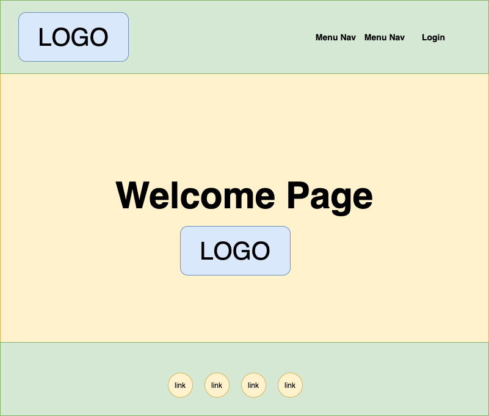
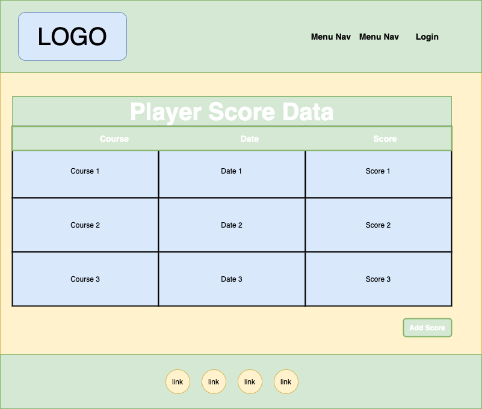
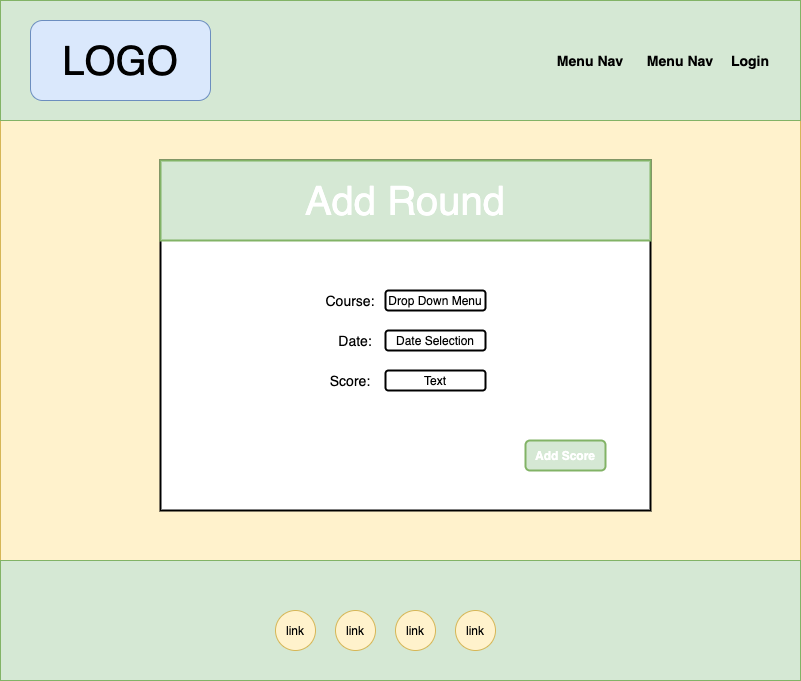
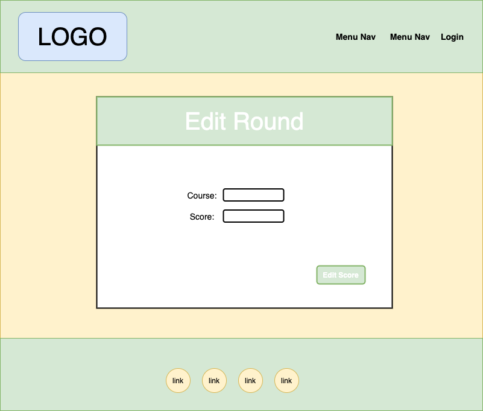
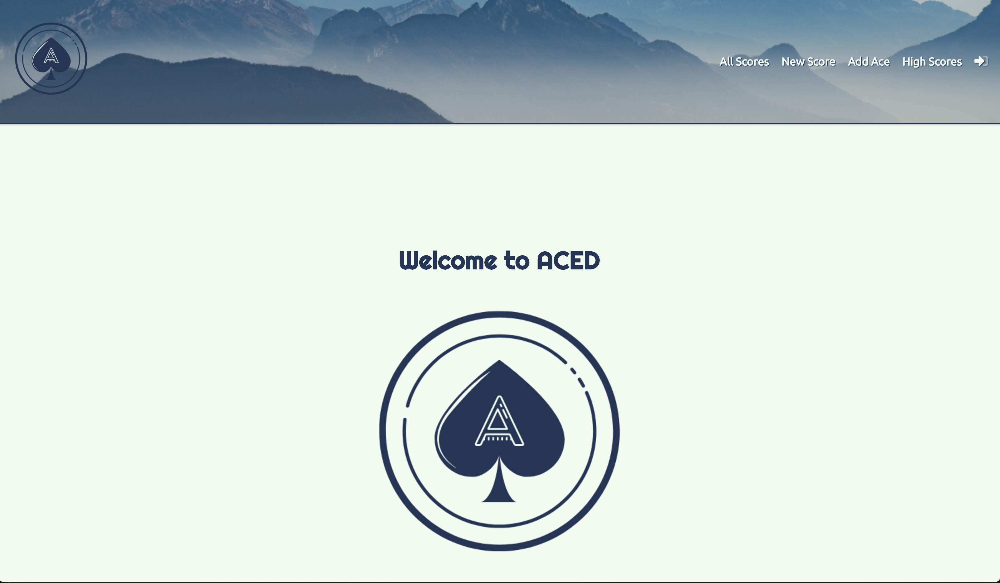
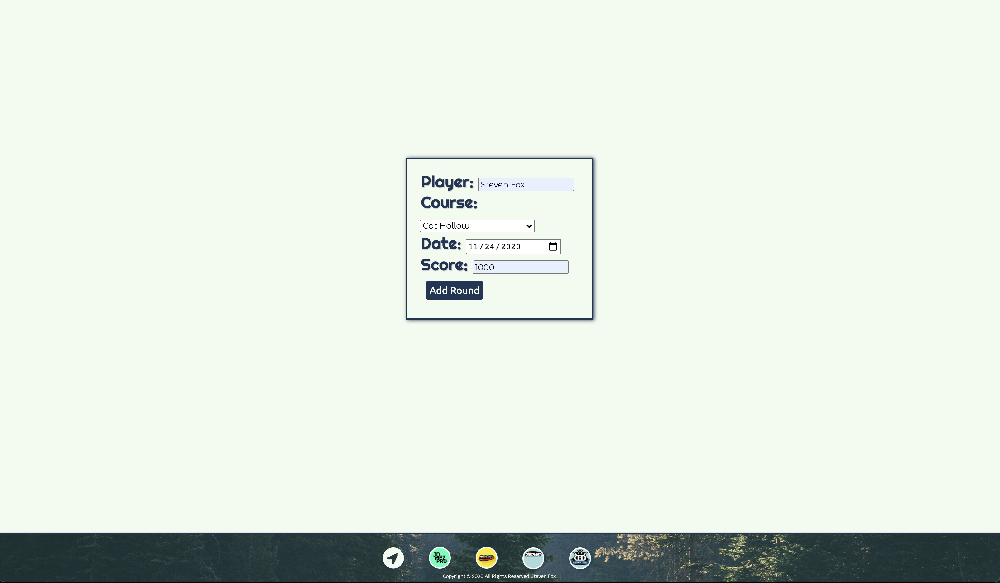
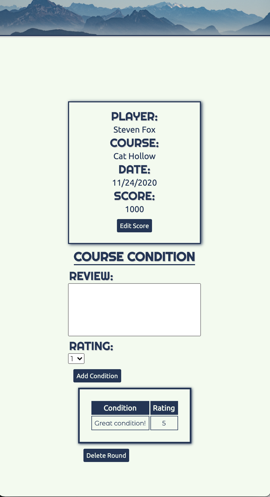
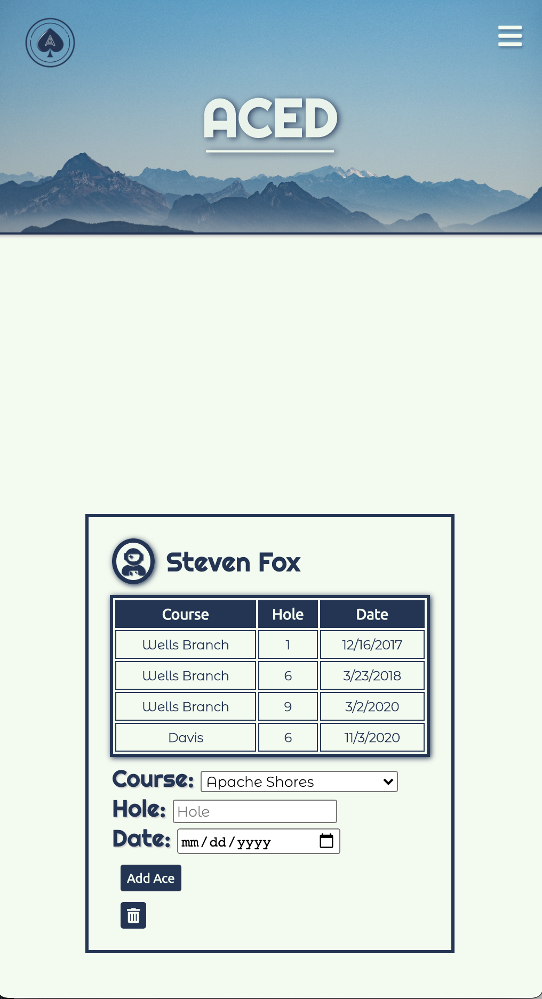

# **Aced**

An application designed with the avid disc golfer in mind. Log rounds played, leave condition reports for courses, and log Aces all in one location.

## Version 1.0
Current build includes:
- New Score Log
- Score edit/delete
- Condition report log
- Ace Log per user
- Google LogIn

### Wireframe:

### App Screenshot(s):

### Technologies:
- HTML5
- CSS3
- JavaScript
- Node.js
- Express
- MongoDB
- Mongoose
- OAuth
- PassportJS
- Google Developers Console
- Heroku

## Getting Started
#### Trello:
https://trello.com/b/VfoVTKjR/project-2-board
#### App:
https://aced-app.herokuapp.com/

### Future Versions to Include
- Player Profiles
- Condition parameters
- Player ID population on new round creation
- Add New Course form submit
- Weather API integration
- Courses played tracker
- Score calculation for leaderboard

